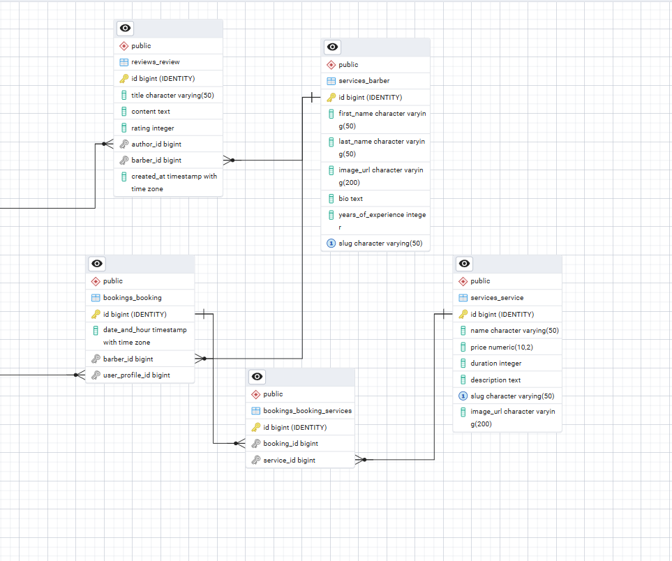

# BarberShop-Advanced Project Documentation

## 1. Introduction
BarberShop-Advanced is a full-stack web application built using the Django framework. It extends the core functionality of a standard barber shop booking system by introducing authentication, authorization, RESTful APIs, asynchronous background processing, and comprehensive automated testing.

The primary goal of the project is to provide a scalable and production-ready system for managing appointments, users, and services, while also exposing functionality through APIs for future integrations (e.g., mobile applications).

---

## 2. Architecture (Django Apps)

### 2.1 Database Schema (ERD)

The project follows a modular monolithic architecture, divided into multiple Django applications:

---

### 2.2 `bookings`
Handles the core business logic for managing appointments.

- **Models:**
  - `Booking`
    - User (client)
    - Service (ForeignKey)
    - Barber (ForeignKey)
    - Date and time

- **Features:**
  - Full CRUD operations for bookings
  - Booking history per user
  - Triggers asynchronous email confirmation (via Celery)

- **Views:**
  - Create, update, delete bookings
  - User booking history

---

### 2.3 `services`
Manages barbers and services offered by the shop.

- **Models:**
  - `Service`
    - Name
    - Description
    - Price
    - Duration

  - `Barber`
    - First name / Last name
    - Bio
    - Years of experience

- **Features:**
  - Full CRUD operations for both models
  - Admin-level management access

---

### 2.4 `reviews`
Provides a complete review system for users.

- **Models:**
  - `Review`
    - User (ForeignKey)
    - Related service or barber
    - Rating
    - Comment
    - Created/updated timestamps

- **Features:**
  - Full CRUD operations
  - Permission-based access control

---

### 2.5 `accounts` (Authentication & Authorization)
Handles user management, authentication, and permissions.

- **Models:**
  - `UserProfile`
    - One-to-One relationship with Django User
    - Stores extended user data

- **Features:**
  - User registration, login, logout
  - Custom permission system
  - Role-based access control
  - Users with specific permissions can perform full CRUD across all models

---

### 2.6 `api` (Django REST Framework)
Provides RESTful API endpoints for the entire system.

- **Features:**
  - CRUD endpoints for:
    - Services
    - Bookings
    - Reviews
    - Users (restricted)
  - Serialization and validation
  - Authentication and permission enforcement
  - Designed for external consumption (e.g., mobile apps)

---

### 2.7 `web` (Main Interface)
Handles general frontend pages and UI rendering.

- **Views:**
  - Homepage
  - General navigation pages

---

## 3. Asynchronous Processing (Celery & Redis)

The project integrates Celery with Redis to handle background tasks.

- **Use Case:**
  - Sending email confirmations after booking creation

- **Benefits:**
  - Non-blocking user experience
  - Improved performance and scalability

---

## 4. Testing Strategy

The project includes comprehensive automated testing:

### 4.1 Unit Tests
- Models
- Forms
- Serializers

### 4.2 Integration Tests
- Views
- API endpoints

### 4.3 Goals
- Ensure reliability of business logic
- Prevent regressions
- Validate API behavior

---

## 5. Templates and Design (Templates & Static)

- **Django Templates:**
  - Template inheritance via `base.html`
  - Reusable components (navbar, footer)

- **Styling:**
  - HTML5 and CSS3
  - Custom styles in `static/css/`

- **UI/UX:**
  - Responsive design
  - Clean and user-friendly layout

- **AI Assistance:**
  - Used for layout ideas and CSS optimization

---

## 6. Dependencies

All required packages are listed in `requirements.txt`.

### Core dependencies:
- Django
- Django REST Framework
- Celery
- Redis

It is strongly recommended to use a virtual environment (`venv`) for dependency isolation.

---

## 7. Environment and Security

### 7.1 Virtual Environment (`venv`)
Used to isolate project dependencies and ensure consistency across environments.

### 7.2 Environment Variables (`.env`)
Sensitive data is stored in a `.env` file and excluded from version control.

Includes:
- `SECRET_KEY`
- Database credentials
- Email configuration
- Celery broker URL

---

## 8. API Overview

- Base URL: `/api/`

### Supported Operations:
- Authentication endpoints
- CRUD operations for:
  - Services
  - Bookings
  - Reviews
  - Users (restricted)

The API is designed to be scalable and easily consumable by external clients.

---

## 9. Future Development (Roadmap)

Potential improvements and extensions:

- JWT authentication for API
- Docker containerization
- Deployment - It will be deployed soon on Azure!
- Payment integration (Stripe)
- Advanced filtering and search in API
- Notifications system (SMS, push notifications)
- Admin dashboard enhancements
- Caching (Redis)

---

## 10. Conclusion

BarberShop-Advanced demonstrates a production-ready Django application with modern backend practices, including API design, asynchronous processing, custom permissions, and thorough testing. It serves as a strong foundation for scalable web applications and future expansion into multi-platform systems.