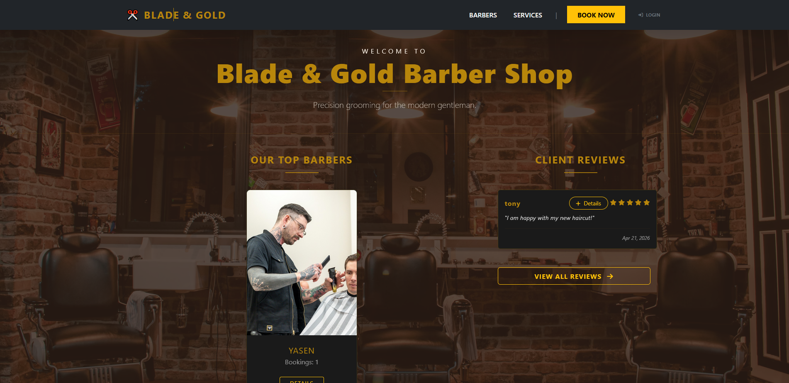

# BarberShop-Advanced ✂️  

**BarberShop-Advanced** is a full-featured web application built with Python (Django), designed for managing and scheduling barber shop appointments. This advanced version expands the core functionality with authentication, REST APIs, background tasks, and comprehensive testing.

[📖 View Full Project Documentation here](./DOCUMENTATION.md)

---

## 🚀 Features

### 🔐 Authentication & Authorization
- User registration, login, and logout system
- Custom permissions system
- Role-based access control for advanced operations
- Extended UserProfile model (One-to-One with Django User)

### ✂️ Core Functionality
- **Service Overview:** Browse available services (haircuts, beard trimming, etc.)
- **Bookings:** Schedule and manage appointments
- **Reviews System:** Full CRUD for user reviews
- **Admin Capabilities:** Authorized users can perform full CRUD across all models

### 🌐 API Layer
- Fully implemented REST API
- CRUD endpoints for all major resources
- API serializers and validation

### ⚙️ Background Tasks
- Celery + Redis integration
- Asynchronous email sending
- Email confirmation when a booking is created

### 🧪 Testing
- Unit Tests for:
  - Models
  - Forms
  - Serializers
- Integration Tests for:
  - Views
  - API endpoints

### 🎨 User Interface
- Clean and responsive UI using Django Templates, HTML, and CSS

---

## 🛠 Technologies Used

### Back-end
- Python
- Django
- Django REST Framework

### Front-end
- HTML5
- CSS3
- Django Templates

### Async & Background Processing
- Celery
- Redis

### Database
- PostgreSQL 

### Testing
- Django Test Framework
- unittest

---

## 📁 Project Structure

- `barber_shop/` – Main Django project configuration
- `bookings/` – Booking system logic
- `services/` – Service and Barber management
- `reviews/` – Reviews app with full CRUD functionality
- `api/` – REST API endpoints and serializers
- `accounts/` – Authentication, authorization, and user profiles
- `templates/` – HTML templates
- `static/` – Static assets (CSS, images)
- `manage.py` – Django management script

---

## 💻 Local Installation and Setup

Follow these steps to run the project locally:

### 1. Clone the repository

git clone https://github.com/AntonVelev21/BarberShop-Advanced.git
cd BarberShop-Advanced

### 2. Create and activate a virtual environment

    python -m venv venv

    # Windows
    venv\Scripts\activate

    # Linux / Mac
    source venv/bin/activate

### 3. Install dependencies

    pip install -r requirements.txt

### 4. Configure environment variables

Create a `.env` file in the project root based on `.env.example`:

    SECRET_KEY=your-secret-key
    DEBUG=True

    DB_NAME=barbershop_db
    DB_USER=postgres
    DB_PASSWORD=yourpassword
    DB_HOST=localhost
    DB_PORT=5432

    EMAIL_HOST=smtp.yourprovider.com
    EMAIL_PORT=587
    EMAIL_HOST_USER=your-email
    EMAIL_HOST_PASSWORD=your-email-password
    EMAIL_USE_TLS=True

    CELERY_BROKER_URL=redis://127.0.0.1:6379/0

### 5. Apply migrations

    python manage.py migrate

### 6. Create superuser (optional)

    python manage.py createsuperuser

---

### 7. Run services

#### Start Redis

    redis-server

#### Start Celery worker

    celery -A barber_shop worker -l info

#### Start Django server

    python manage.py runserver

Open: http://127.0.0.1:8000/

---

## 🔌 API Usage

- API base URL: `/api/`
- Supports:
  - Authentication endpoints
  - CRUD operations for:
    - Services
    - Bookings
    - Reviews
    - Users (restricted)

Use tools like Postman or cURL to test endpoints.

---

## 🧪 Running Tests

    python manage.py test

---

## 📄 License

This project is licensed under the terms of the MIT License.
